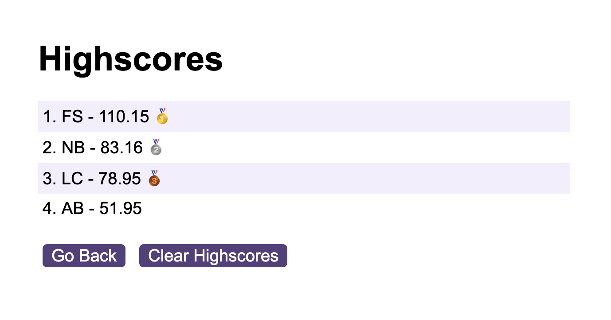

# central-perk-pub-quiz
[](https://www.javascript.com) 

Live prototype hosted on Github Pages: https://sonictrain.github.io/central-perk-pub-quiz/

## Table of Contents 
- [Preview](#preview)
- [Description](#description)
- [Features](#features)
- [Usage](#usage)
- [Credits](#credits)
- [License](#license)

## Preview



## Description
An engaging pub quiz about Friends crafted with JavaScript, featuring 10 questions. For each correct answer, users are rewarded with an additional 15 seconds, while each incorrect answer results in a deduction of 15 seconds. The quiz begins with a 60-second timer, and the remaining time becomes the actual score. The scores are stored in the browser's local storage, allowing users to input their initials and access a leaderboard showcasing high scores. If users are unable to answer all 10 questions within the allotted time, a 'gameOver' function is triggered. Users are then directed to a final page where they can choose to retry the game or check the high score.

## Features
- Local Storage set/get/clear
- Web Api for DOM Manipulation
- Timer-based quiz
- Leaderboard

## Usage
Simply clone the repo using the following command:
```
git clone <repository-address>
```

cd inside the the repository on your local machine:
```
cd central-perk-pub-quiz
```

and finally launch the `index.html` file with a browser of your choice.
Alternatively feel free to visit the web app from [this link](https://sonictrain.github.io/central-perk-pub-quiz/).

## Credits
- Sorting algorithm implemented in this project, using the .sort() method is based on the excellent explanation and code provided by FreeCodeCamp. Check out the original article: [JavaScript Sort Array - How to Sort an Array Accurately](https://www.freecodecamp.org/news/how-to-sort-javascript-array-accurately/).
- [Shield.io](https://shields.io/) for their awesome badges!

## License
[](https://github.com/Naereen/StrapDown.js/blob/master/LICENSE)

Copyright (c) Nicola Brucoli. All rights reserved.
Licensed under the [MIT](./LICENSE) license.